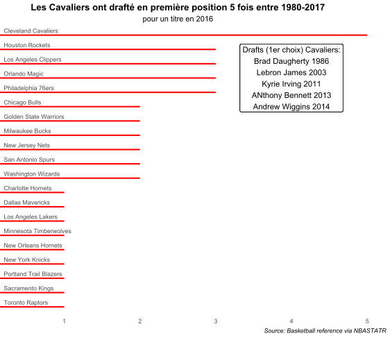
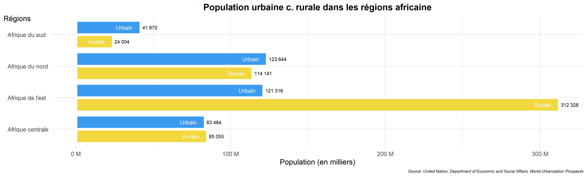
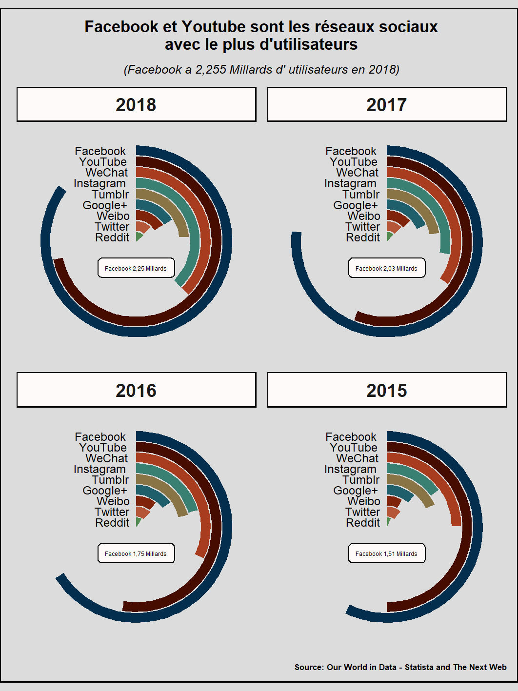

**Le cours de datavisualisation à l'UPHF que je donne sous la forme d'un module polytechnique (il s'appelle présenter une données) a commencé début février. Il s'organise en distanciel asynchrone. Tous les quinze jours, les étudiants ont accès à de nouveaux contenus (textes, vidéos, données...) que je met à leur disposition via le campus virtuel. L'idée est de les amener assez vite à pouvoir être alaise avec les outils de manière à produire leurs propres graphes. J'y présente R, le tidyverse et surtout ggplot (mais pas que).J'insiste également sur ce qui fait la différence entre une représentation parlante, qui porte un message, et un simple empilement de données agrémenté de formes et de couleurs.**

Dans une partie des vidéos du cours, je code des graphes pas à pas à partir de jeux de données trouvés sur internet sur des sites de type Our World in Data. Ce sont celles-ci que je souhaites partager avec vous ici. Le montage est brute, parfois maladroit, et demanderait sûrement un peu de travail. On est plus sur un style blog mais pour des premières je penses que ce n'est pas si mal.

* Diagramme à bâtons simple

* Diagramme à bâtons pairés

* Diagramme à bâtons circulaire

