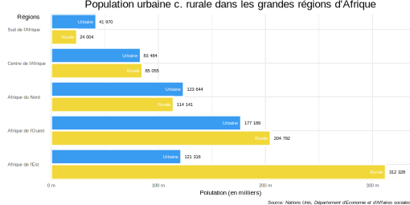
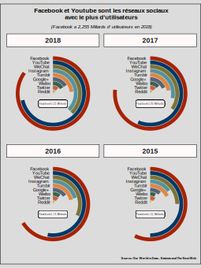

**Le cours de datavisualisation à l'UPHF que je donne sous la forme d'un module polytechnique (dont le nom est "présenter une donnée") a commencé début février. Il s'organise en distanciel asynchrone. Tous les quinze jours, les étudiants ont accès à de nouveaux contenus (textes, vidéos, données...) que je met à leur disposition via le campus virtuel. L'idée est de les amener assez vite à pouvoir être à l'aise avec les outils de manière à produire leurs propres graphes. J'y présente R, le tidyverse et surtout ggplot, mais pas que. J'insiste également sur ce qui fait la différence entre une représentation parlante, qui porte un message clair, et un simple empilement de données agrémenté de formes et de couleurs.**

Dans une partie des vidéos, je code des graphes pas à pas à partir de jeux de données trouvées sur internet sur des sites de type [Our World in Data](https://ourworldindata.org/). Ce sont les premières de ces vidéos que je souhaites partager ici. Le montage est brute, parfois (souvent) maladroit, et demanderait sûrement un peu de travail supplémentaire. On est plus sur un style vlog que sur un vidéo-cours structuré. Néanmoins, pour des premières tentatives, je penses que ce n'est pas si mal.

Vous trouverez ci-dessous un aperçu de chaque graphe réalisé. Pour accéder aux vidéos, il vous suffit simplement de cliquer dessus.

* **Diagramme à bâtons simples**

* **Diagramme à bâtons pairés**

* **Diagramme à bâtons circulaires**

____________________________________________________

